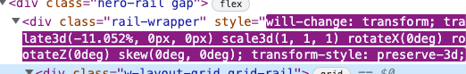

# 220329 TIL

## Grid

mui grid

-> 부트 스트랩 grid와 같은 원리로 작업하면 된다.

## 차이 페이지 분석

translate3d에서 x 값이 계속 감소하다가 100%가 되면 1이 되고 흘러가는 애니메이션이 멈춤.

### transform: translate3d

https://developer.mozilla.org/en-US/docs/Web/CSS/transform-function/translate3d

### animation & keyframes

https://jsfiddle.net/4sf16n2y/

#### 일렬로 나열하기

`white-space: nowrap;` : 없으면 일렬로 나열이 안된다.

## 기타

github에 contributors가 안뜨면 commit을 한 번 해봐라