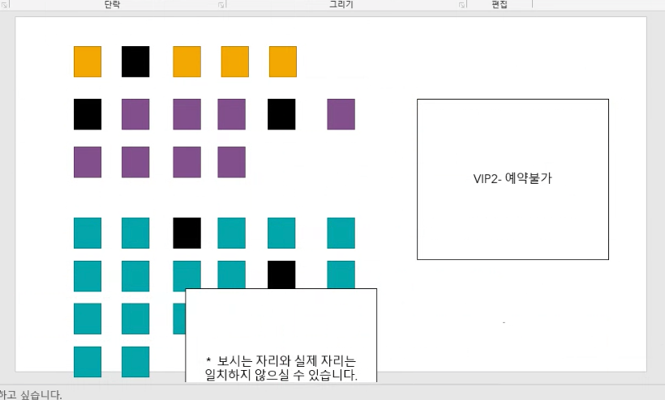

# 220401


## React className 동적으로 선언하기


## onClick 이벤트 여러개 적용하기

이벤트 적용 방법

1. ```<button onClick={ onClickHandler }> 첫번째 방법 </button>```
2. ```<button onClick={ () => { onClickHandler() }}> 두번째 방법 </button>```


다중 이벤트를 적용하려면 이 중 2번 방법을 사용해야 한다.

```javascript
<button onClick={ () => { 
  onClickHandler()
  onClickHandler2()
}}> 두번째 방법 </button>
```


## className 동적 선언

### DOM에 직접 추가

```javascript
 <div 
	className={"seat " + (seatCheck ? "selected" : "")} 
	onClick={ () => {
  	seatChoice()
  	addSeat()
	}}></div>
```

- seat 뒤에 +로 추가할 수 있다,
  - 이때 주의할점은 seat뒤에 반드시 스페이스바로 한 자를 띄워줘야 작동한다.


## 웹 스토리지

- localStorage : 동일한 컴퓨터에서 동일한 브라우저를 사용할 때만 해당

- sessionStorage : 


## 동적 컴포넌트 생성

https://inuplace.tistory.com/710


